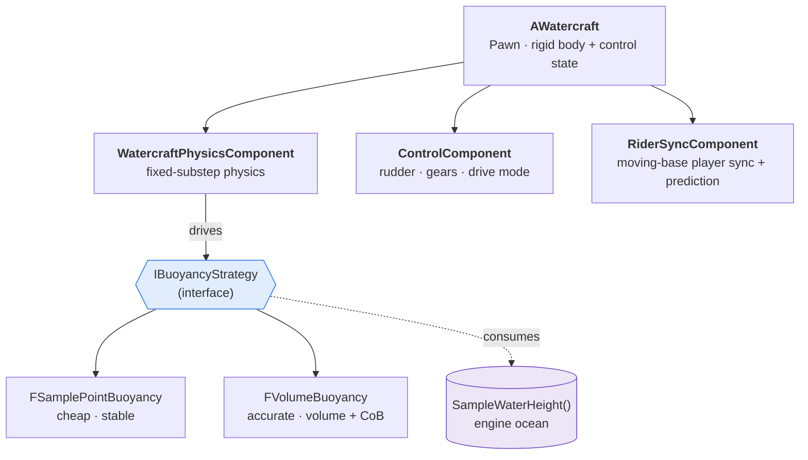

# Watercraft Physics — Buoyancy & Multiplayer Sailing

> 开放世界里"玩家自建、真实物理漂浮"的船只系统的技术参照实现：两种浮力解法、帧率无关的定步长物理、以及**移动平台上多名玩家的网络同步**。
>
> A reference implementation of the physics and networking behind **player-built, physically-simulated watercraft** in an open-world multiplayer game — two buoyancy solutions, frame-rate-independent fixed-substep integration, and synchronization of **multiple players moving on a moving, rotating platform**.

<p align="left">
  
  
  
  
</p>

---

## 📌 Context

This distills work I owned in a shipped commercial title, where I was responsible for the
watercraft system: the framework, buoyancy and water physics, piloting, and all of the
multiplayer synchronization. The engine supplied only the ocean's surface *rendering* and a
water-height query (`SampleWaterHeight(pos)`); everything documented here sits on top of that.

> **This repository is a clean-room reference.** The code illustrates the architecture and the
> techniques — it is original, written for portfolio purposes, and contains **no proprietary
> or third-party source**. It is deliberately reduced to the load-bearing ideas rather than a
> full engine integration.

---

## 🎯 The problem, precisely

A watercraft here is not a scripted platform — it is a **rigid body floating on a wave field**
that must satisfy four constraints simultaneously:

| Constraint | Why it's hard |
|---|---|
| **Feels good** | Must read as weighty and stable, not floaty or twitchy — a tuning-sensitive, subjective target. |
| **Frame-rate independent** | Identical behaviour from 30 fps mobile to 120 fps desktop; force integration is sensitive to `dt`. |
| **Carries multiple players** | Players stand and *walk around* on a base that is itself translating and rotating. |
| **Network-consistent & cheap** | Every client must agree on the boat *and* everyone on it, in real time, without saturating the channel. |

The three engineering decisions that resolve these — and, importantly, *why* each was chosen
over the obvious alternative — are the substance below.

---

## 🧭 Architecture



**Design rules I held to:**

- **One base craft, extended by composition.** A raft, a larger vessel, or a new drive mode are
  *extensions* that reuse the same components — never a fork of the framework (open/closed).
- **Physics, control, and networking are separate components** (single responsibility), so
  retuning buoyancy never risks the replication path, and vice-versa.
- **Buoyancy is a strategy behind one interface**, so the rest of the craft is agnostic to which
  of the two implementations is running — see the trade-off in §2.

---

## 🎮 Gameplay: boarding, the helm, and sailing

A raft is player-built and crewable. You board through a **boarding region**, and stepping into
the **driver region** puts you at the helm. From there the moment-to-moment gameplay is:

- **Two propulsion modes** — *manual paddle* (forward / back) for fine control in tight water, or
  raise the **sail** (half / full) to catch the wind for real speed.
- **Wind matters** — sail thrust is the wind's component along the heading, scaled by sail area,
  so you trim your heading against the wind instead of driving in a straight line.
- **Steer with the rudder** — the rudder value is replicated; steering authority scales with
  speed (a drifting raft barely turns).
- **Gears** — Back / Stop / Slow / Half / Full.

```cpp
// RaftControlComponent — sail thrust is wind projected onto the raft's forward axis, by sail area.
FVector URaftControlComponent::ComputeSailForce(const FVector& Wind) const
{
    const FVector Forward = GetOwner()->GetActorForwardVector();
    const float   Along   = FVector::DotProduct(Wind, Forward);   // tailwind vs headwind
    return Forward * (Along * SailSize * Val_SailForceFactor);
}
```

Inputs are client-predicted (`Client_*`) and server-authoritative (`Server_*`); the rudder value,
drive mode, and sail size replicate to everyone, so all clients agree on how the boat is being
driven. See [`src/RaftControlComponent.h`](src/RaftControlComponent.h).

> This is the *control* layer that sits on top of the physics below — it produces the thrust and
> steering forces that §1's fixed substep integrates each tick.

### The wave field the physics actually reads

The ocean's *rendering* is the engine's. But physics can't read back a rendered surface — it needs
an **analytic, CPU-side wave field** evaluable at any point and time, that still matches the
visuals, or the boat visibly floats off the water.

- **Trochoidal (Gerstner) waves**, not plain sines — sharper crests, flatter troughs, which is
  what real swell looks like; a `Sharpness` term controls exactly that.
- **Tiled with cached corner depths**, bilinearly interpolated inside a tile: waves shrink toward
  the shore and only reach full height in deep water.
- **Several wave trains** of differing direction and wavelength are summed, driven by wind.

```cpp
// ！！！OceanTime 必须全局同步 / OceanTime MUST be globally synchronized — never each
// client's own accumulated local time. Otherwise wave phase drifts apart between clients
// and the same boat sits at different heights on each screen, which breaks the boat sync
// in §3 that rests on everyone seeing the same water.
float UOceanManager::SampleWaterHeight(const FVector& WorldPos) const;
```

See [`src/OceanWaveField.h`](src/OceanWaveField.h).

---

## 1. Frame-rate independence: fixed-substep integration

**Decision.** Run the craft's physics on a fixed-timestep accumulator (60 Hz), decoupled from the
render frame, instead of applying buoyancy once per rendered frame.

**Why.** Per-frame force integration makes the craft behave differently at 30 fps and 120 fps —
it visibly bobs differently, and, far worse, clients running at different frame rates cannot
agree on the boat's height. That disagreement is fatal for the sync in §3. Fixing the timestep
makes the simulation **deterministic with respect to frame time**, which is a *precondition* for
stable networking, not merely a polish detail.

```cpp
// WatercraftPhysicsComponent.cpp — physics advances only in fixed dt slices.
void UWatercraftPhysicsComponent::TickPhysics(float DeltaTime)
{
    Accumulator += DeltaTime;

    int32 Steps = 0;
    while (Accumulator >= Val_FixedStep && Steps < Val_MaxSubsteps)  // 60 Hz slices
    {
        IntegrateSubstep(Val_FixedStep);
        Accumulator -= Val_FixedStep;
        ++Steps;
    }
    if (Steps >= Val_MaxSubsteps) Accumulator = 0.0f;   // fell behind: drop backlog, no death spiral
}
```

See [`src/WatercraftPhysicsComponent.cpp`](src/WatercraftPhysicsComponent.cpp).

---

## 2. Buoyancy: two strategies behind one interface

**Decision.** Ship **two** buoyancy implementations behind [`IBuoyancyStrategy`](src/BuoyancyStrategy.h),
selectable per craft, rather than committing to a single model.

**Why.** There is no single right answer — it's an accuracy-vs-cost curve, and different craft sit
at different points on it. Forcing one model on the whole game means either paying volume-integration
cost on a trivial raft, or accepting a starter raft's fidelity on a hero vessel. An interface makes
the choice *data*, and keeps control/networking code oblivious to it.

| Strategy | Method | Cost | Behaviour | Best for |
|---|---|---|---|---|
| `FSamplePointBuoyancy` | Per-probe force by submersion depth | O(N) probes, no mesh work | Very stable, approximate | Simple craft (rafts) |
| `FVolumeBuoyancy` | Clip hull triangles, submerged volume + true center of buoyancy, Archimedes | O(triangles) | Realistic tilt & self-righting | Hero vessels |

```cpp
// BuoyancyStrategy.cpp — accurate path: force = rho*g*V applied at the TRUE center of buoyancy.
if (SubmergedVolume > KINDA_SMALL_NUMBER)
{
    VolumeCentroid /= SubmergedVolume;                                    // true center of buoyancy
    const float Force = Val_WaterDensity * Val_Gravity * SubmergedVolume; // Archimedes
    Body.AddForceAtPosition(FVector::UpVector * Force, VolumeCentroid);
}
```

**Why sample points suffice for a raft:** a raft is essentially a flat slab, so four corner probes
already express pitch and roll correctly — a corner sitting deeper gets pushed harder, and the
craft self-levels. **What the volume method buys instead:** the centre of buoyancy *moves on its
own*. As the hull heels, the submerged centroid shifts to that side, producing a genuine righting
moment — banking in turns and self-righting emerge with no special-case code.

Two details that separate "floats" from "feels right":

- **Per-probe force is clamped.** Without a clamp, a corner plunging underwater launches the whole
  craft out of the water.
- **Damping is quadratic in velocity and scaled by submersion.** At low speed it barely intervenes
  (the boat still rides the swell); at high speed it clamps down hard; and a craft out of the water
  isn't dragged by water it isn't touching.

The payoff: the same craft, control, and netcode drove *both* a cheap starter raft and a
physically-accurate vessel with zero change outside the strategy.

---

## 3. The hard one: players on a moving platform

**Decision.** Replicate each rider's motion in the **platform's local frame**, and layer
**client-side prediction with reconciliation** on top — rather than replicating rider world
positions directly.

**Why.** A boat is a base that is itself moving and rotating. If a rider's *world* position is
replicated naively, disagreements about *where the boat is* compound with disagreements about
*where the rider is on it* — producing jitter, rubber-banding, and riders visibly sliding off the
deck on remote screens. Storing the rider **relative to the boat** collapses the first error
source: every client reconstructs `world = authoritativeBoatXform * localOffset`, so the rider is
correct on deck by construction, independent of small boat-position disagreements.

```cpp
// RiderSyncComponent — world position is reconstructed, never replicated directly.
FVector URiderSyncComponent::ResolveRiderWorldPosition(const FRiderState& Rider) const
{
    const FTransform BoatXform = GetBoatTransformForFrame(Rider.BaseFrameId);
    return BoatXform.TransformPosition(Rider.LocalOffset);   // boat-local -> world
}

// Predict locally for responsiveness; reconcile only when authoritative state drifts past threshold.
void URiderSyncComponent::OnServerRiderState(const FRiderState& Server)
{
    const float Error = FVector::Dist(PredictedHistory.Get(Server.BaseFrameId), Server.LocalOffset);
    if (Error > Val_ReconcileThreshold)
    {
        LocalOffset = Server.LocalOffset;             // snap the base
        ReplayPendingInputs(Server.BaseFrameId);      // re-apply unacked inputs on top
    }
    // else: prediction was good enough — no visible correction.
}
```

**Bandwidth discipline that made it shippable on weak networks:**

- Rider deltas are **quantized** (`FVector_NetQuantize`) and sent only past a movement threshold.
- Boat transform updates are **rate-limited and prioritized**; on detected packet loss the per-tick
  update budget shrinks so the channel degrades gracefully instead of collapsing.
- Because §1 made the boat deterministic per substep, clients **predict** it between updates — so
  fewer updates are needed for the same visual quality.

See [`src/RiderSyncComponent.h`](src/RiderSyncComponent.h).

---

## 🗂️ Repository layout

```
watercraft-physics/
├── README.md
└── src/
    ├── RaftControlComponent.h        Gameplay: boarding/helm, paddle vs sail, rudder, gears
    ├── OceanWaveField.h              Gameplay/physics: trochoidal wave field, depth tiles, wind
    ├── BuoyancyStrategy.h            Strategy interface + two implementations
    ├── BuoyancyStrategy.cpp          Sample-point & submerged-volume (clip + centroid) math
    ├── WatercraftPhysicsComponent.h  Fixed-substep driver (frame-rate independence)
    ├── WatercraftPhysicsComponent.cpp
    └── RiderSyncComponent.h          Moving-base rider sync: local-frame + prediction/reconcile
```

The code is a **reduced reference** — the load-bearing algorithms and interfaces, with engine
integration (physics backend, actual replication channel) abstracted behind small facades so the
ideas read clearly.

---

## 💡 What this demonstrates

End-to-end ownership of a **physics- and network-heavy** gameplay system; comfort with rigid-body
simulation, numerical stability, and multiplayer netcode; and the engineering judgment to build
*two* solutions behind one interface, and to recognize that fixed-timestep determinism is what
makes the networking tractable in the first place.

## 📜 Notes

Original reference code authored by me for portfolio purposes. No proprietary or third-party
source is included; the engine facades (`FRigidBodyState`, `SampleWaterHeight`) are illustrative
stand-ins for the real integration points.
